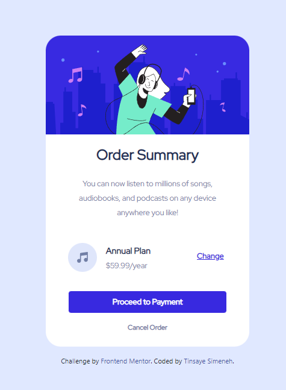

# Frontend Mentor - Ordinary Summary card component solution

This is a solution to the Expense Chart Component. Frontend Mentor challenges help you improve your coding skills by building realistic projects. 

## Table of contents

- [Overview](#overview)
  - [The challenge](#the-challenge)
  - [Screenshot](#screenshot)
  - [Links](#links)
  - [Built with](#built-with)
  - [What I learned](#what-i-learned)
- [Author](#author)

## Overview

### The challenge

Users should be able to:

- View the optimal layout depending on their device's screen size
- See hover and focus states for interactive elements

### Screenshot

### Links

- Solution URL: [https://www.frontendmentor.io/solutions/order-summary-component-Mt30wYYPI7](https://www.frontendmentor.io/solutions/order-summary-component-Mt30wYYPI7)
- Live Site URL: [https://fm-order-summary-rose.vercel.app/](https://fm-order-summary-rose.vercel.app/)

## My process

### Built with

- Semantic HTML5 markup
- CSS custom properties
- CSS Grid
- [Bootstrap](https://https://getbootstrap.com/) - CSS Framework

### What I learned

This project teaches me how to use bootstrap and how to use it to make a responsive website.
Additionally, the use of media queries, CSS Grid and also the design workflows.
## Author

- Github - [@tinsaye-simeneh](https://github.com/tinsaye-simeneh)
- Frontend Mentor - [@tinsaye-simeneh](https://www.frontendmentor.io/profile/tinsaye-simeneh)

